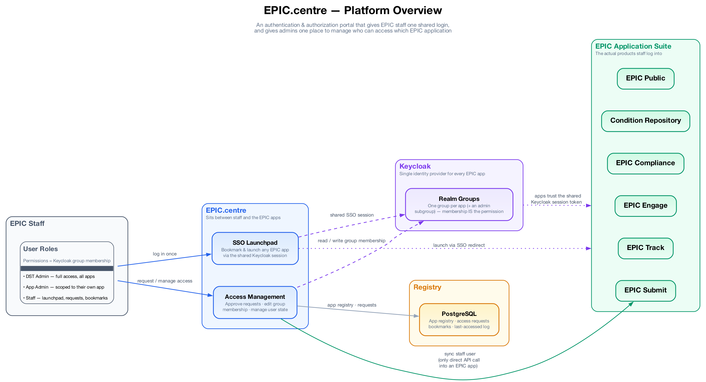
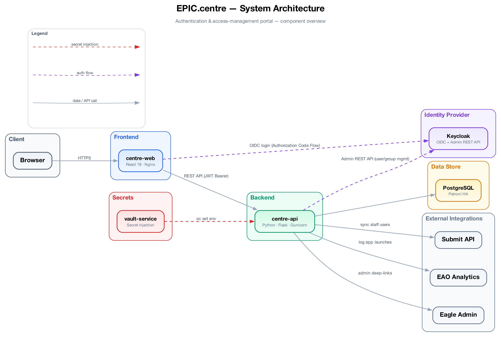
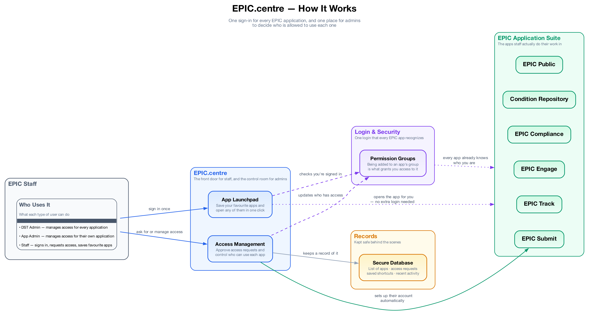

# EPIC.centre Architecture

Last reviewed: 2026-09-16

EPIC.centre is a React and Flask application that sits between EPIC staff, the shared identity platform, EPIC.auth/Auth API, and the EPIC application suite. It is not the system of record for Keycloak users or groups; it provides a safer user interface and workflow layer for reading and changing access.

## Diagrams

The maintained diagram assets live in [diagrams/](diagrams/README.md).

### Platform Overview



### System Architecture



### How It Works



The PNGs are useful for orientation. The code-verified details below are the source of truth for current runtime behavior.

## Runtime Components

| Component | Path | Runtime | Responsibility |
| --- | --- | --- | --- |
| Browser client | `centre-web/` | React 18, TypeScript, Vite, Material UI, TanStack Router, TanStack Query, Zustand | Authenticates with OIDC, renders launchpad/access-management pages, calls Centre API with bearer tokens |
| Static web server | `centre-web/Dockerfile`, `centre-web/nginx/` | Node 18 build stage, Nginx production stage | Builds and serves the SPA, including runtime `config.js` mounted from OpenShift ConfigMap |
| Centre API | `centre-api/` | Python 3.9, Flask 3, Flask-RESTX, Gunicorn | Owns Centre workflows, local persistence, auth checks, and integration calls |
| PostgreSQL | `deployment/charts/centre-patroni/` | Patroni-managed PostgreSQL in OpenShift | Stores application registry, access requests, settings, login history, email queue, and URL/SSL records |
| Identity provider | external | Keycloak / loginproxy OIDC | Authenticates users and issues JWTs |
| Auth API | external, configured by `AUTH_API` | REST API | User and group lookup/mutation proxy over Keycloak |
| Submit API | external, configured by `SUBMIT_API_URL` | REST API | Receives staff-user sync calls when EPIC Submit access is granted |

## High-Level Flow

```text
Browser
  -> centre-web
      -> Keycloak/loginproxy for OIDC authorization code login
      -> centre-api with Authorization: Bearer <access_token>
          -> validates token using OIDC/JWKS config
          -> reads/writes PostgreSQL
          -> delegates user/group reads and writes to Auth API
          -> calls Submit API when Submit access is granted
```

Operational probes are not under the API blueprint:

- `GET /ops/healthz` checks database connectivity.
- `GET /ops/readyz` reports readiness.

Swagger/OpenAPI routes are under `/api`.

## Frontend Pages

| Route | Purpose |
| --- | --- |
| `/launchpad` | Application launchpad, Document Search, AI search widget for users with `ai_search_user`, bookmarks, and app ordering |
| `/request-access` | Self-service request catalog for requestable EPIC applications |
| `/request-access/auth` | Admin view for pending requests and user search |
| `/request-access/auth/users/$username` | User-specific access management page |
| `/application-urls` | Application URL and SSL tracking for users with `view_ssl_info` or `edit_app_url` |
| `/oidc-callback`, `/logout`, `/unauthenticated`, `/access-denied`, `/error` | Authentication and error support routes |

Frontend runtime configuration is read from `window._env_` when deployed and from `import.meta.env` during local development. The deployed `config.js` is produced by `deployment/charts/centre-web/templates/configmap.yaml`.

## API Namespaces

All API namespaces are registered under `/api/`.

| Namespace | Representative endpoints | Purpose |
| --- | --- | --- |
| `applications` | `GET /api/applications`, `GET /api/applications/request-catalog`, `POST /api/applications/{id}/access_request`, `GET /api/applications/{app_name}/access-levels` | Launchpad applications, request catalog, new access requests, app access levels |
| `users` | `GET /api/users`, `GET/PATCH /api/users/username/{username}`, `PUT/DELETE /api/users/{username}/access` | User search, user detail, enable/disable, group assignment and revocation |
| `access-requests` | `GET /api/access-requests`, `GET /api/access-requests/users/{guid}`, `PUT /api/access-requests/{id}` | Pending/completed access request review and status updates |
| `user-applications` | `PATCH /api/user-applications/bookmarks`, `PATCH /api/user-applications/sort-order` | Per-user bookmarks and launchpad ordering |
| `user-settings` | `GET /api/user-settings`, `PUT /api/user-settings/card-positions`, `PUT /api/user-settings/settings` | Per-user UI preferences |
| `eao-analytics` | `GET/POST /api/eao-analytics` | Records app launch/login timestamps in `login_histories` |
| `application-urls` | `GET/POST /api/application-urls`, `PUT/DELETE /api/application-urls/{id}` | Application URL and SSL tracking |
| `app-configs` | `GET /api/app-configs` | Frontend app configuration values returned by API |

## Authentication

1. `centre-web` redirects unauthenticated users to the configured OIDC authority.
2. Keycloak/loginproxy returns an access token to the SPA.
3. The frontend sends the token to `centre-api` using `Authorization: Bearer <token>`.
4. `centre-api` validates issuer, audience, algorithm, signature, and expiry using `flask-jwt-oidc` and the configured OIDC discovery/JWKS values.
5. The API uses token-derived user identity and groups for workflow decisions, and forwards the same bearer token to Auth API for user/group reads and writes.

## Authorization Model

Centre authorization is based on Keycloak group membership and selected client roles.

| User type | How detected | Capabilities |
| --- | --- | --- |
| Staff | Authenticated user with application group membership | Launchpad, bookmarks, app ordering, request access |
| App admin | Member of an app admin group path | Manage access requests and users for that application |
| DST admin | Member of Centre admin group path | Manage users and requests across applications, except compliance approval rules handled separately |
| URL/SSL viewer | `view_ssl_info` role on `epic-centre` token client roles | View `/application-urls` |
| URL/SSL editor | `edit_app_url` role on `epic-centre` token client roles | Create/update/delete application URL records |
| AI search user | `ai_search_user` token client role | See the AI document search widget |

Default backend admin group path values are loaded from environment variables with these fallbacks:

| App client | Default admin group path |
| --- | --- |
| `epic-centre` | `CENTRE/SUPER_USER` |
| `epictrack-web` | `TRACK/INSTANCE_ADMIN` |
| `epic-compliance` | `COMPLIANCE/SUPERUSER` |
| `epic-engage` | `ENGAGE/INSTANCE_ADMIN` |
| `epic-submit` | `SUBMIT/EAO_MANAGER` |
| `epic-condition` | `CONDITION-REPO/INSTANCE_ADMIN` in backend defaults, `CONDITION-REPO/ADMIN` in chart values |
| `epic-public` | `PUBLIC/ADMIN` |

Keep these files aligned when Keycloak group names change:

- Backend defaults and env mapping: `centre-api/src/centre_api/enums/epic_app.py`
- Backend deployment values: `deployment/charts/centre-api/values.yaml`
- Frontend admin checks: `centre-web/src/utils/adminGroupPaths.ts`

## Access Request Flow

```text
Staff user
  -> POST /api/applications/{id}/access_request
  -> access_requests row with status PENDING
  -> email_queue rows for requester, DST, and app admins

Admin user
  -> reviews request in /request-access/auth
  -> approves by assigning a Keycloak group through PUT /api/users/{username}/access
      -> Centre API delegates group write to Auth API
      -> request status becomes APPROVED
      -> email_queue row for access_granted_notification.html
      -> if app is epic_submit, Centre API calls Submit API to create/sync staff user
  -> or rejects through PUT /api/access-requests/{id}?status=REJECTED
      -> request status becomes REJECTED
      -> email_queue row for access_denied_notification.html
```

Compliance requests require compliance-specific admin access for approval/rejection. DST admin access alone is intentionally not enough in `AccessRequestsService.has_admin_access_on_app()`.

## Application Registry

The registry is seeded by migrations and exposed through `/api/applications`. The runtime launch URL is resolved from environment variables rather than the seeded `launch_url` column.

| Name | Title | Launch URL variable |
| --- | --- | --- |
| `condition_repository` | Condition Repository | `CONDITION_REPOSITORY_LAUNCH_URL` |
| `epic_compliance` | EPIC.compliance | `EPIC_COMPLIANCE_LAUNCH_URL` |
| `document_search` | Document Search | `DOCUMENT_SEARCH_LAUNCH_URL` |
| `epic_track` | EPIC.track | `EPIC_TRACK_LAUNCH_URL` |
| `epic_public` | EPIC.public | `EPIC_PUBLIC_LAUNCH_URL` |
| `epic_submit` | EPIC.submit | `EPIC_SUBMIT_LAUNCH_URL` |
| `epic_engage` | EPIC.engage | `EPIC_ENGAGE_LAUNCH_URL` |
| `intranet` | Intranet | `INTRANET_LAUNCH_URL` |

`document_search` and `intranet` are treated as public launchpad entries and are excluded from the self-service request catalog. `epic_compliance` is also excluded from that catalog by current service logic.

## Persistence

See [DATABASE.md](DATABASE.md) for schema details. The active model-backed tables are:

- `applications`
- `user_applications`
- `access_requests`
- `user_settings`
- `login_histories`
- `email_queue`
- `application_urls`

Historical migrations create and later remove older structures such as `bookmarks` and `staff_users`.

## Deployment Topology

OpenShift deployment is chart-based:

- `centre-web` serves the built SPA on port 8080.
- `centre-api` serves Flask through Gunicorn on port 8080.
- `centre-api` has an init container that runs `flask db upgrade` through `pre-hook-update-db.sh` before the app container starts.
- `centre-patroni` provides the database service used by the API.
- Runtime secrets and environment values are provided through Secrets and ConfigMaps generated by Helm charts and secret-management workflows.

See [DEPLOYMENT.md](DEPLOYMENT.md) for GitHub Actions, image tags, and release procedures.

For the repository layout and documentation ownership rules, see [OVERVIEW.md](OVERVIEW.md) and the root [README.md](../README.md).
